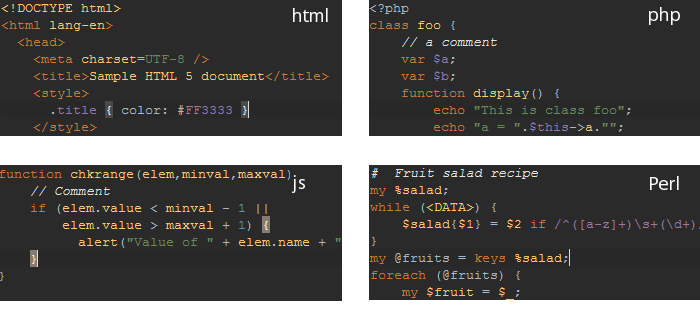
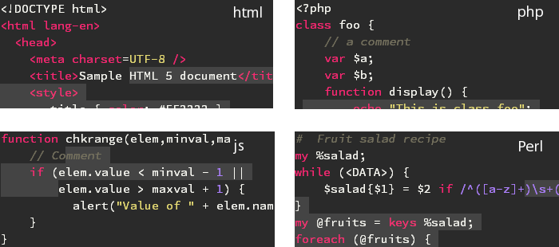
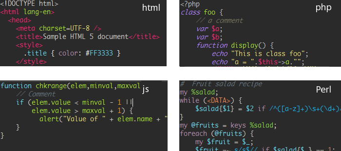
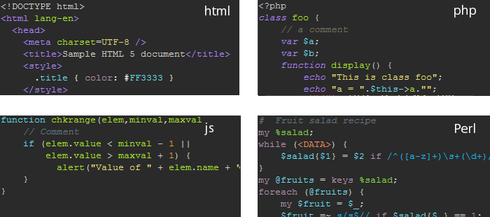
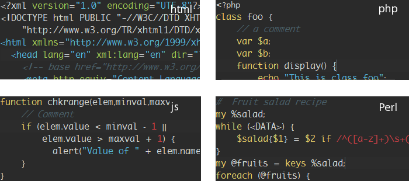

# Deep-focus-color-schemes
Color schemes for Deep Focus skin Komodo Edit/IDE

Color shemes adapted for the [Deep focus skin](https://github.com/babobski/Deep-Focus-Skin).

## Install
 * Just unzip the folder
 * drag and drop the color schemes in to komodo

## Dracula
Adapted from [Dracula](https://github.com/babobski/Dracula-scheme) - by me  

## Soda dark
Adapted from [Soda dark](https://github.com/Defman21/soda-komodo) - by [Defman21](https://github.com/Defman21)  

## Monokai
Adapted from [Monokai](https://github.com/Defman21/monokai-komodo) - by [Defman21](https://github.com/Defman21)  

## Monokai Purple
Adapted from [Monokai](https://github.com/Defman21/monokai-komodo) - by [Defman21](https://github.com/Defman21)  

## Flasty
Adapted from [Flasty](https://github.com/Defman21/flasty-komodo) - by [Defman21](https://github.com/Defman21)  

